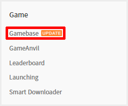

##################################
Gamebase Console에서 프로젝트 생성
##################################

Gamebase를 사용하기 위해서 Conslole에서 프로젝트를 생성합니다.

프로젝트 생성
==============

1. TOAST Console 접속
    - https://console.toast.com

2. TOAST Console 상단 대시보드에서 새 프로젝트 생성
    - 프로젝트 이름 : GamebaseSample
    - 프로젝트 설명 : Sample for Gamebase

Gamebase 서비스 활성화
=======================

1. 좌측 사이드 메뉴에서 **서비스 추가** 클릭
2. **Game > Gamebase** 선택 및 활성화

3. 좌측 사이드 메뉴에서 **Game > Gamebase** 선택
4. **앱 > 클라이언트** 이동
5. Android 등록
    - 스토어 : Google Play
    - 클라이언트 버전 : 1.0.0
    - 서비스 상태 : 테스트
    - 서버 주소 : 빈 값
    .. image:: _static/image/console_android_app.png

