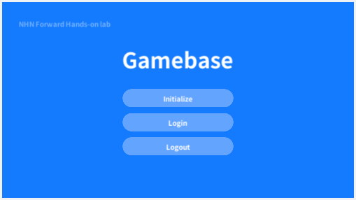

#######################
Gamebase Initialize
#######################

설정값 확인
=========================
NHN Cloud Console 에서 App ID와 App Version 확인

* App ID

  .. image:: _static/image/console_app_id.png

* App Version

  .. image:: _static/image/console_app_version.png

Initialize 구현
=========================

**Assets/TOAST/Codelab/Gamebase/Scripts/HandsOnLab/UserImplementation.cs** 파일의 Initialize() 함수에 다음과 같이 코드 입력

.. code-block:: C#

  public static void Initialize()
  {
      var configuration = new GamebaseRequest.GamebaseConfiguration
      {
        appID = "{AppID}",
        appVersion = "{AppVersion}",
        storeCode = GamebaseStoreCode.GOOGLE,
        displayLanguageCode = Gamebase.GetDisplayLanguageCode()
      };
      
      Gamebase.Initialize(configuration, (launchingInfo, error) =>
      {
          if (Gamebase.IsSuccess(error) == true)
          {
              SampleLogger.Log("Gamebase initialization succeeded.");
          }
          else
          {
              SampleLogger.Log(string.Format("Gamebase initialization failed. Error:{0}", error));
          }
      });
  }

Build & Run
=========================

Menu > File > Save Project

1. Android 디바이스 연결
2. **Menu > File > Build & Run**

  .. image:: _static/image/unity_build_and_run.png

3. APK 파일 이름: gamebase-handsonlab.apk
4. 디바이스에서 실행 확인
5. Click **Initialize**

Troubleshooting
==================

Initialze 중 오류가 발생할 경우 다음 문서를 참고하시기 바랍니다.

* `Error Handling <http://docs.toast.com/ko/Game/Gamebase/ko/unity-initialization/#error-handling>`_ 

.. tip::

    - Error Code = 32인 경우에는 AndroidManifest 설정을 다시 확인하시기 바랍니다.
