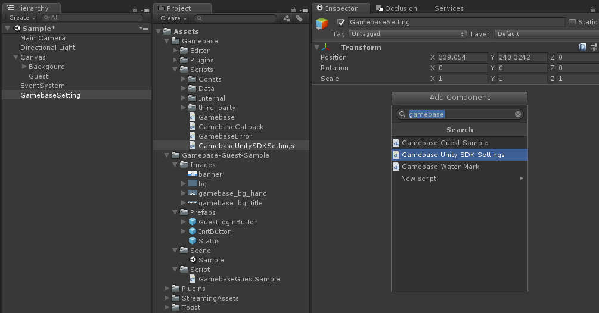
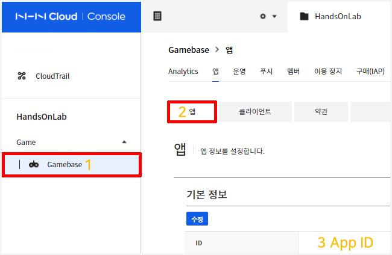
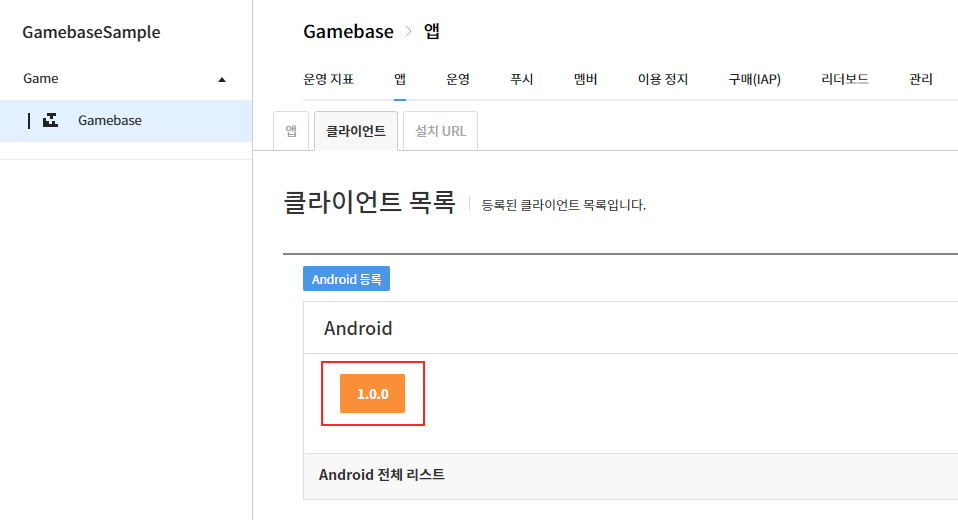
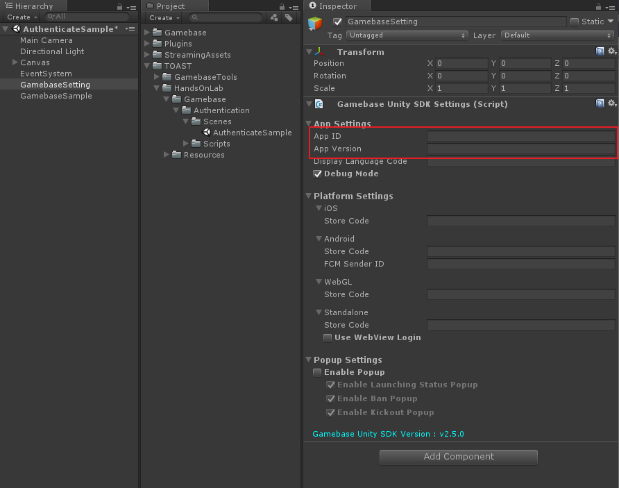

#######################
Gamebase 설정
#######################

Game Object 생성
=========================

* Hierarchy Window > 우클릭 > Create Empty 
    * Name : GamebaseSetting
* Inspector Window > Add Component : Gamebase Unity SDK Settings
    

Inspector 설정
=========================

Gamebase Console 값을 참고해서 다음 값들을 셋팅합니다.

* Hierarchy Window > GamebaseSetting 클릭
* Inspector Window
    * App ID 입력
    * App Version 입력

