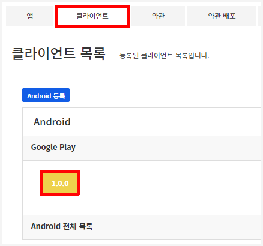

#######################
Gamebase 설정
#######################

Inspector 설정
=========================

Gamebase Console 값을 참고해서 다음 값들을 셋팅합니다.

* Hierarchy Window > GamebaseSetting 클릭
* Inspector Window
    * App ID 입력
    * App Version 입력

.. image:: _static/image/unity_app_setting.png
    :scale: 50%

