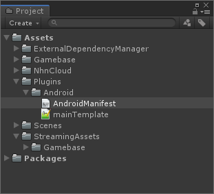

#######################
Android Manifest 설정
#######################

AndroidManifest 파일 복사
===========================

* 소스 경로 : {Unity 설치 폴더}/Editor/Data/PlaybackEngines/AndroidPlayer/Apk/AndroidManifest.xml 
* 대상 경로 : {Project Root}/Assets/Plugins/Android/AndroidManifest.xml

AndroidManifest 파일 수정
===========================

* package name 변경: com.nhnent.gamebaseguest
* activity name 변경 : com.toast.gamebase.activity.GamebaseMainActivity

