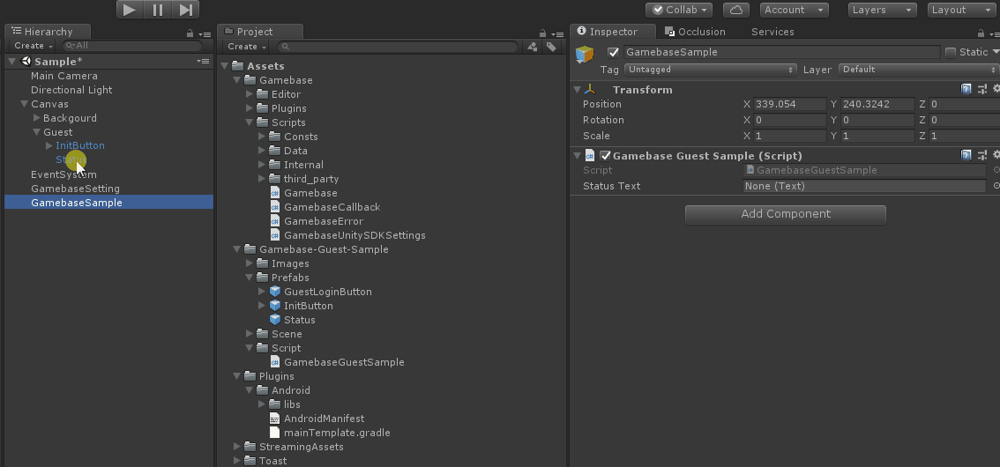
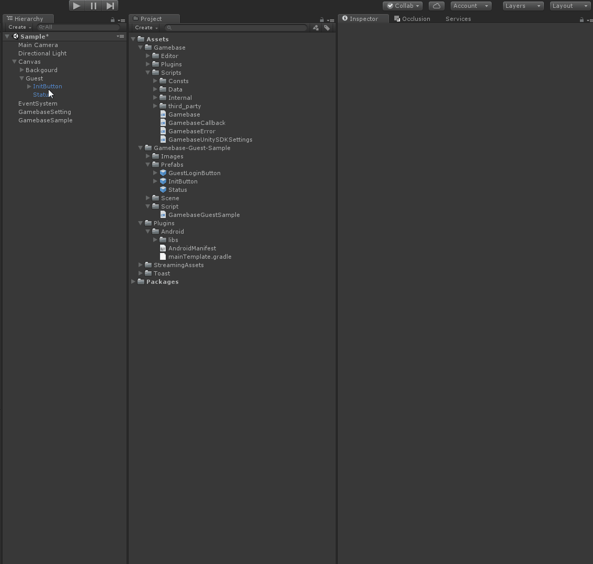
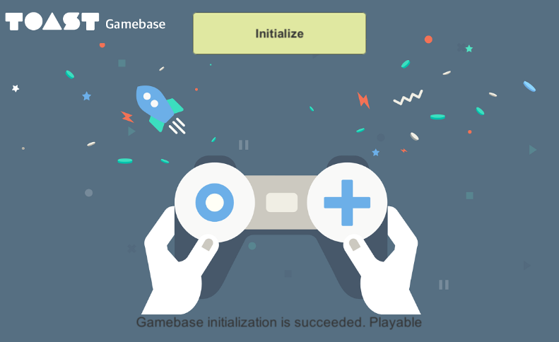

#######################
Gamebase Initialize
#######################

UI 추가
=========================

Assets/Gamebase-Guest-Sample/Prefabs/ 폴더에서 InitButton, Status prefab 파일을 Hierarchy Window의 Guest 하위로 드래그 앤 드롭

.. image:: _static/image/unity_add_initbutton_status.gif
    :scale: 50%

Text Object 연결
=========================

* Hierarchy Window > GamebaseSample 클릭
* Status Text 연결

InitButton Event 설정
=========================

* InitButton의 OnClick() 이벤트를 GamebaseSample.GamebaseInitialize() 함수가 받도록 설정

Initialize 구현
=========================

* Assets/Gamebase-Guest-Sample/Script/GamebaseGuestSample.cs 파일의 GamebaseInitialize() 함수에 다음과 같이 코드 입력

.. code-block:: C#

    public void GamebaseInitialize()
    {
        Gamebase.Initialize((launchingInfo, error) =>
        {
            if (Gamebase.IsSuccess(error) == true)
            {
                statusText.text = "Gamebase initialization is succeeded.";

                if (IsPlayable(launchingInfo.launching.status.code) == true)
                {
                    statusText.text += " Playable";
                }
                else
                {
                    statusText.text += string.Format(" message : {0}", launchingInfo.launching.status.message);
                }
            }
            else
            {
                statusText.text = string.Format("Gamebase initialization is failed. Error is {0}", error.ToString());
            }
        });
    }

Build & Run
=========================

Menu > File > Save Project

1. Android 디바이스 연결
2. **Menu > File > Build & Run**
3. APK 파일 이름 지정 팝업이 뜰 경우 **gamebase-guest.apk** 로 설정
4. 디바이스에서 실행 확인
5. **Initialize** 버튼 클릭 후 Initialize 성공 확인

Troubleshooting
==================

Initialze 중 오류가 발생할 경우 다음 문서를 참고하시기 바랍니다.

* `Error Handling <http://docs.toast.com/ko/Game/Gamebase/ko/unity-initialization/#error-handling>`_ 

.. tip::

    - Error Code = 32인 경우에는, :ref:`AndroidManifest` 내용을 다시 확인하시기 바랍니다.
