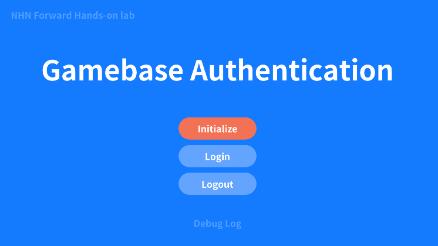

#######################
Gamebase Logout
#######################

Logout 구현
===============================

* Assets/TOAST/Codelab/Gamebase/Scripts/HandsOnLab/UserImplementation.cs 파일의 Logout() 함수에 다음과 같이 코드 입력

.. code-block:: C#

    public void Logout()
    {
        Gamebase.Logout((error) =>
        {
            if (Gamebase.IsSuccess(error) == true)
            {
                SampleLogger.Log("Logout succeeded.");
            }
            else
            {
                SampleLogger.Log(string.Format("Logout failed. Error is {0}", error.ToString()));
            }
        });
    }

Build & Run
===============================

Menu > File > Save Project

1. Android 디바이스 연결
2. **Menu > File > Build & Run**
3. APK 파일 이름 지정 팝업이 뜰 경우 **gamebase-handsonlab.apk** 로 설정
4. 디바이스에서 실행 확인
5. **Initialize** 버튼 클릭 후 Initialize 성공 확인
6. **Login** 버튼 클릭 후 Login 성공 확인
7. **Logout** 버튼 클릭 후 Logout 성공 확인

Troubleshooting
===============================

Logout 중 오류가 발생할 경우 다음 문서를 참고하시기 바랍니다.

`Error Handling <http://docs.toast.com/ko/Game/Gamebase/ko/unity-authentication/#error-handling>`_ 