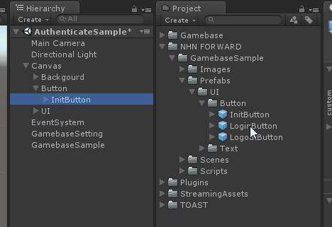
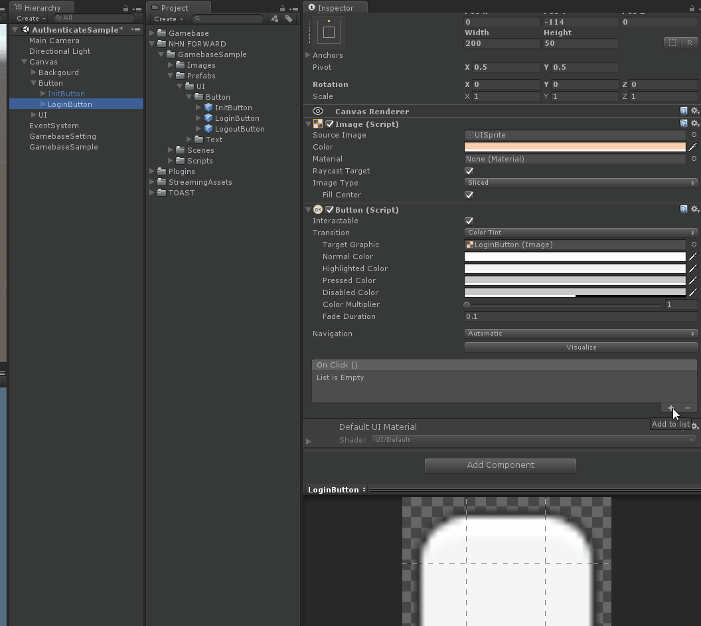
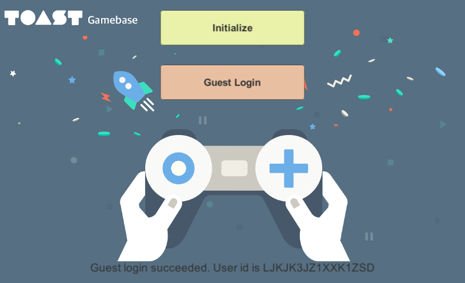

#######################
Gamebase Guest Login
#######################

UI 추가
===============================

Assets/Gamebase-Guest-Sample/Prefabs/GuestLoginButton.prefab 파일을 Hierarchy Window의 Guest 하위로 드래그 앤 드롭

GuestLoginButton Event 설정
===============================

* GuestLoginButton의 OnClick() 이벤트를 GamebaseSample.GamebaseGuestLogin() 함수가 받도록 설정

Guest Login 구현
===============================

* Assets/Gamebase-Guest-Sample/Script/GamebaseGuestSample.cs 파일의 GamebaseGuestLogin() 함수에 다음과 같이 코드 입력

.. code-block:: C#

    public void GamebaseGuestLogin()
    {
        Gamebase.Login(GamebaseAuthProvider.GUEST, (authToken, error) =>
        {
            if (Gamebase.IsSuccess(error) == true)
            {
                statusText.text = string.Format("Guest login succeeded. User id is {0}", authToken.member.userId);
            }
            else
            {
                statusText.text = string.Format("Guest login failed. Error is {0}", error.ToString());
            }
        });
    }

Build & Run
===============================

Menu > File > Save Project

1. Android 디바이스 연결
2. **Menu > File > Build & Run**
3. APK 파일 이름 지정 팝업이 뜰 경우 **gamebase-guest.apk** 로 설정
4. 디바이스에서 실행 확인
5. **Initialize** 버튼 클릭 후 Initialize 성공 확인
6. **Guest Login** 버튼 클릭 후 로그인 성공 확인

Troubleshooting
===============================

Login 중 오류가 발생할 경우 다음 문서를 참고하시기 바랍니다.

`Error Handling <http://docs.toast.com/ko/Game/Gamebase/ko/unity-authentication/#error-handling>`_ 